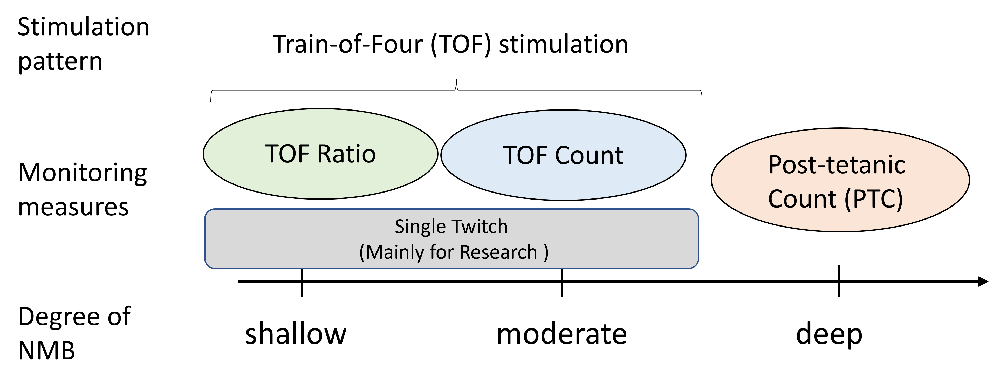

# NMBsim: A Neuromuscular Blockade Simulator for TOF and PTC

## Overview
NMBsim is a MATLAB-based simulator developed from the study *"A Comprehensive Model of Neuromuscular Monitoring Measures During General Anesthesia."* 
This model incorporates the effects of Non-depolarizing Neuromuscular Blockers (NDNBs) on neuromuscular transmission and predicts neuromuscular monitoring measures such as Train-of-Four Ratio (TOFR), Train-of-Four Count (TOFC), and Post-tetanic Count (PTC).

<p align="center">
  
</p>


This repository includes:
- **MATLAB code**: Implementation of the neuromuscular transmission model 
- **.mat data**: Parameter datasets of 21 patients 
- **Documentation**: Model description, usage guide, and parameter identification results

## Installation
Ensure MATLAB is installed before proceeding.

```sh
git clone https://github.com/uhyogo-epa/NMBsim.git
cd NMBsim
```

## Usage
### Running the Simulation
Execute the following command in MATLAB to obtain the concentration-effect relationship for patient 01:
```matlab
run('src/main.m')
```

### Loading Patient Data
To load specific patient data:
```matlab
data = load('data/patient_01.mat');
```

### Complete simulation including PK model: 
Execute the following command to 
```matlab
run('src/pk_pd_simulation.m');
```

## Data
`.mat` files in the `data/` directory contain:
- **Patient Information:** Age, weight, gender
- **Rocuronium infusion:** Time course of rocuronium infusion rate during operation 
- **Neuromuscular Monitoring Measures:** Clinically observed TOFR, TOFC, and PTC 
- **PD Model Parameters: ** Optimized parameters for pharmacodynamic modeling

For more details, refer to [docs/data_description.md](docs/data_description.md).


## License
This project is licensed under the [MIT License](LICENSE).


## References
- H. Hoshino, H. Miyaguchi, E. Furutani, T. Sugawara, T. Takeda, and G. Shirakami, *"A Comprehensive Model of Neuromuscular Monitoring Measures During General Anesthesia,"* 
