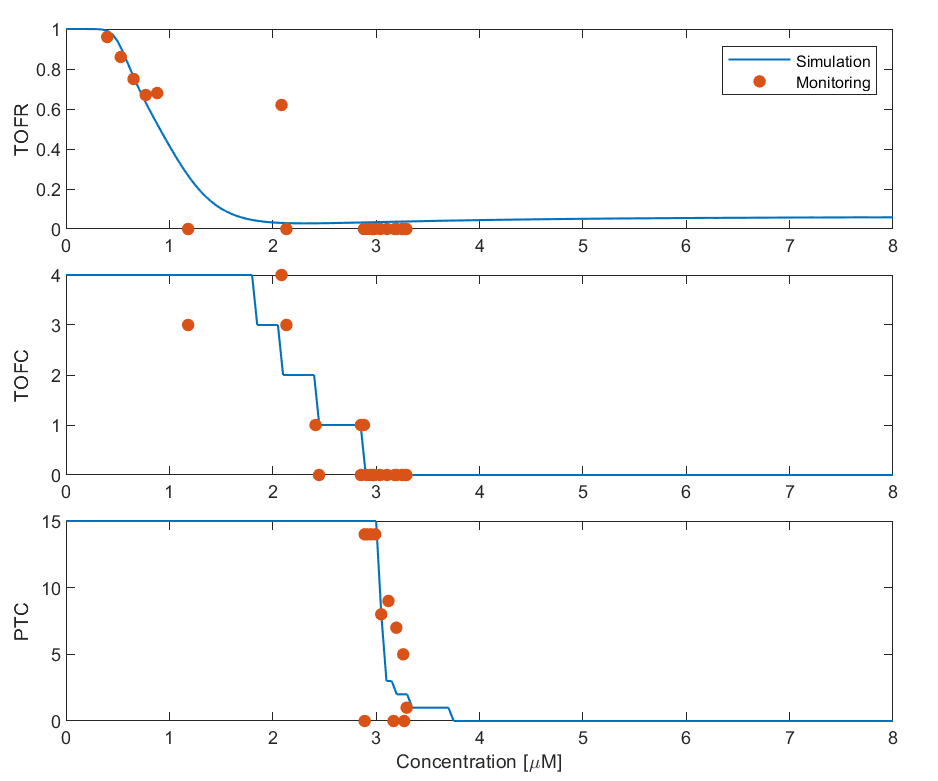
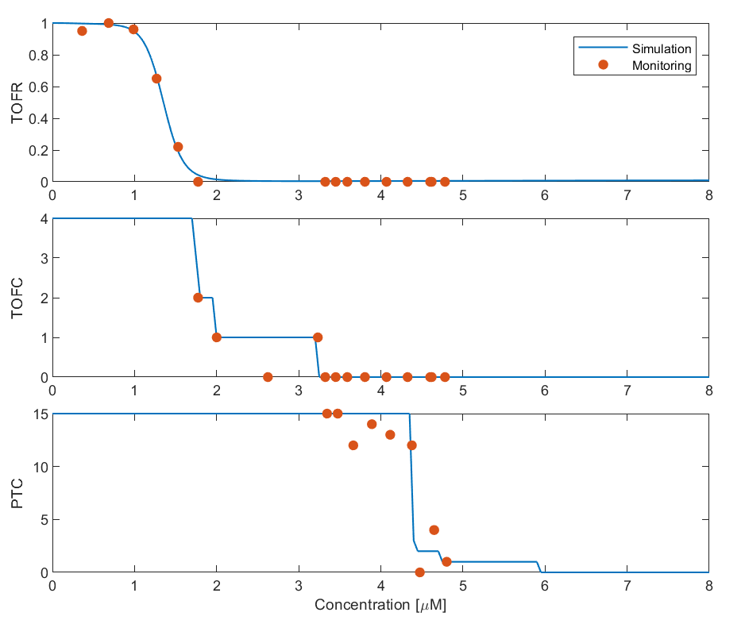
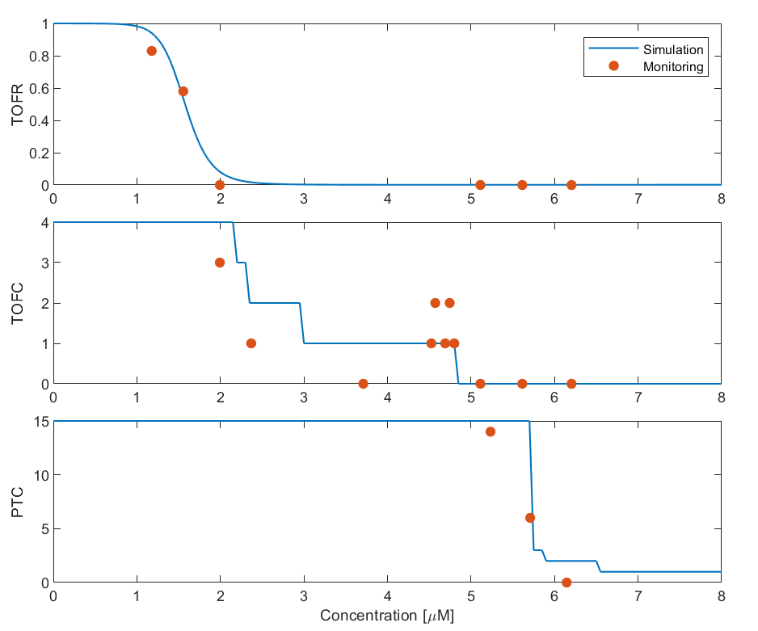
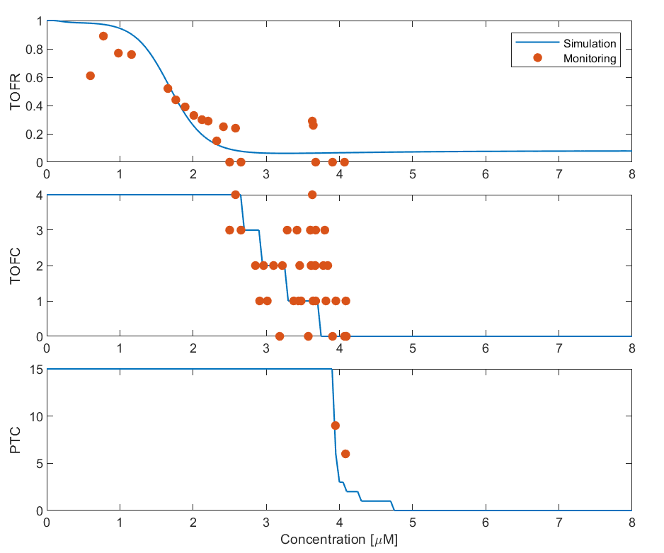
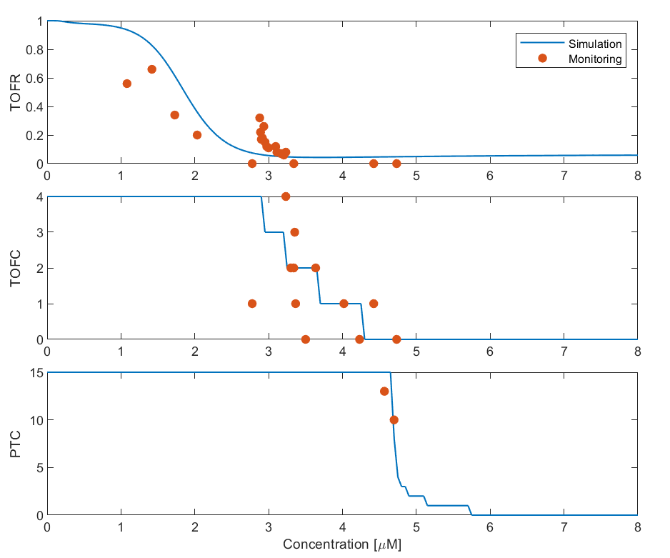
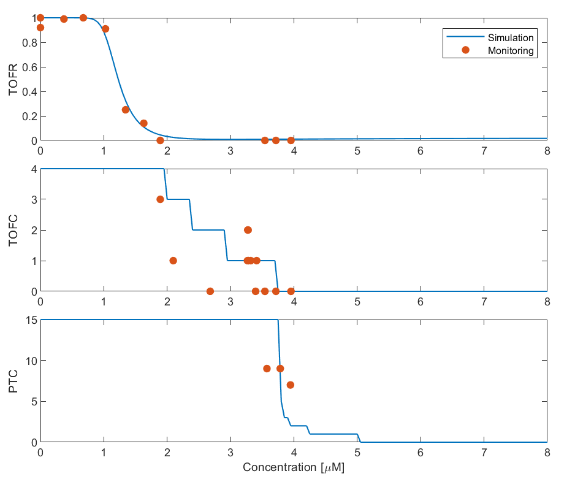
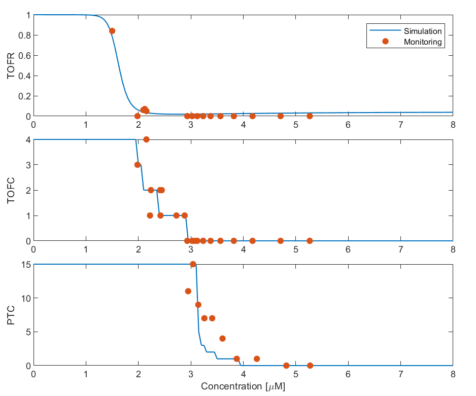
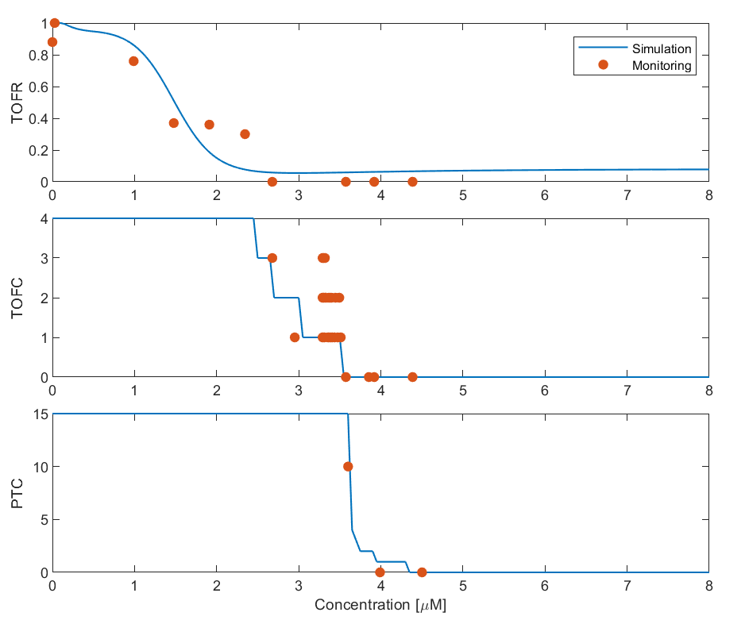

# Data Description

## Overview
This document describes the dataset included in the `data/` directory. The dataset contains optimized parameter data for 21 patients who underwent general anesthesia with neuromuscular blockade. The parameters were identified using clinical data from elective surgical procedures.

The clinical data were obtained at Kagawa University Hospital with approval of the institutional medical ethics committee(No: 2021-139 and 2025-136). This dataset includes:
- **Patient Information:** Age, weight, gender
- **Observed Neuromuscular Monitoring Measures:** Train-of-Four Ratio (TOFR), Train-of-Four Count (TOFC), and Post-tetanic Count (PTC)
- **Rocuronium Infusion Rates:** Administered dosage over time
- **Parameter Estimation Results:** Identified parameters based on clinical observations

Each `.mat` file corresponds to an individual patient and contains all relevant data for reproducibility.

## Patient Information
The table below lists the age, weight, and gender of the 21 patients included in this study.

| Patient ID | Age (years) | Weight (kg) | Gender |
|------------|------------|------------|--------|
| 01         | 47         | 53.9       | F      |
| 02         | 64         | 71.0       | F      |
| 03         | 78         | 60.0       | M      |
| 04         | 52         | 70.0       | M      |
| 05         | 69         | 66.2       | M      |
| 06         | 46         | 63.6       | F      |
| 07         | 69         | 66.7       | M      |
| 08         | 74         | 88.5       | M      |
| 09         | 49         | 90.1       | M      |
| 10         | 66         | 43.1       | M      |
| 11         | 69         | 74.0       | M      |
| 12         | 42         | 50.3       | F      |
| 13         | 35         | 55.2       | F      |
| 14         | 28         | 52.2       | F      |
| 15         | 38         | 65.0       | M      |
| 16         | 68         | 60.1       | F      |
| 17         | 69         | 53.4       | F      |
| 18         | 71         | 62.8       | M      |
| 19         | 46         | 58.2       | F      |
| 20         | 46         | 49.4       | F      |
| 21         | 64         | 105.5      | M      |

## Pharmacodynamic relationships 

The concentration-effect relationship was analyzed for each patient. 

<table align="center">
  <tr>
    <td align="center"> <b>Patient 01</b></td>
    <td align="center"> <b>Patient 02</b></td>
    <td align="center"> <b>Patient 03</b></td>
  </tr>
  <tr>
    <td align="center"> <b>Patient 04</b></td>
    <td align="center"> <b>Patient 05</b></td>
    <td align="center"> <b>Patient 06</b></td>
  </tr>
  <tr>
    <td align="center"> <b>Patient 07</b></td>
    <td align="center"> <b>Patient 08</b></td>
    <td align="center"> <b>Patient 09</b></td>
  </tr>
  <tr>
    <td align="center"> <b>Patient 10</b></td>
    <td align="center"> <b>Patient 11</b></td>
    <td align="center"> <b>Patient 12</b></td>
  </tr>
  <tr>
    <td align="center"> <b>Patient 13</b></td>
    <td align="center"> <b>Patient 14</b></td>
    <td align="center"> <b>Patient 15</b></td>
  </tr>
  <tr>
    <td align="center"> <b>Patient 16</b></td>
    <td align="center"> <b>Patient 17</b></td>
    <td align="center"> <b>Patient 18</b></td>
  </tr>
  <tr>
    <td align="center"> <b>Patient 19</b></td>
    <td align="center"> <b>Patient 20</b></td>
    <td align="center"> <b>Patient 21</b></td>
  </tr>
</table>

## Notes
- The `.mat` files in `data/` contain all relevant simulation data for reproducibility.
- The pharmacodynamic parameters were estimated based on the observed neuromuscular monitoring measures.

For more details on the model and methodology, refer to [model_description.md](model_description.md).
