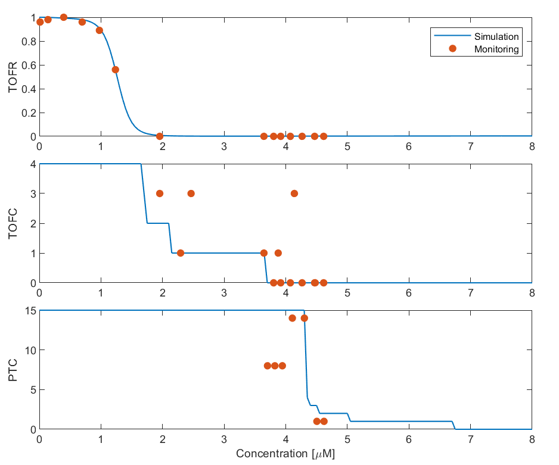
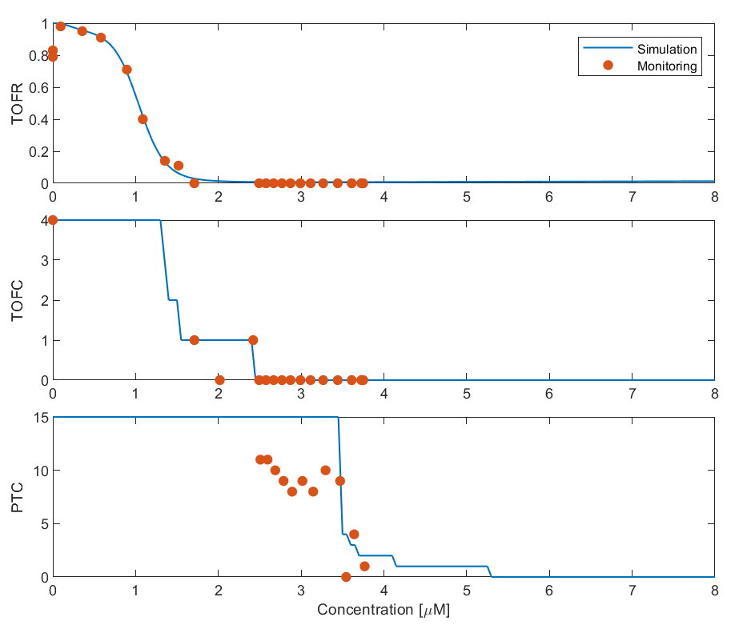

# Data Description

## Overview
This document describes the dataset included in the `data/` directory. The dataset contains optimized parameter data for 21 patients who underwent general anesthesia with neuromuscular blockade. The parameters were identified using clinical data from elective surgical procedures.

The clinical data were obtained at Kagawa University Hospital with approval of the institutional medical ethics committee (No: 2019-250). This dataset includes:
- **Patient Information:** Age, weight, gender
- **Observed Neuromuscular Monitoring Measures:** Train-of-Four Ratio (TOFR), Train-of-Four Count (TOFC), and Post-tetanic Count (PTC)
- **Rocuronium Infusion Rates:** Administered dosage over time
- **Parameter Estimation Results:** Identified parameters based on clinical observations

Each `.mat` file corresponds to an individual patient and contains all relevant data for reproducibility.

## Patient Information
The table below lists the age, weight, and gender of the 21 patients included in this study.

| Patient ID | Age (years) | Weight (kg) | Gender |
|------------|------------|------------|--------|
| 01         | XX         | XX         | M/F    |
| 02         | XX         | XX         | M/F    |
| ...        | ...        | ...        | ...    |
| 21         | XX         | XX         | M/F    |

## Pharmacodynamic relationships 

The concentration-effect relationship was analyzed for each patient. 

<table align="center">
  <tr>
    <td align="center"> <b>Patient 01</b></td>
    <td align="center"> <b>Patient 02</b></td>
    <td align="center"> <b>Patient 03</b></td>
  </tr>
  <tr>
    <td align="center"> <b>Patient 04</b></td>
    <td align="center"> <b>Patient 05</b></td>
    <td align="center"> <b>Patient 06</b></td>
  </tr>
</table>

## Notes
- The `.mat` files in `data/` contain all relevant simulation data for reproducibility.
- The pharmacodynamic parameters were estimated based on the observed neuromuscular monitoring measures.

For more details on the model and methodology, refer to [docs/model_description.md](docs/model_description.md).
