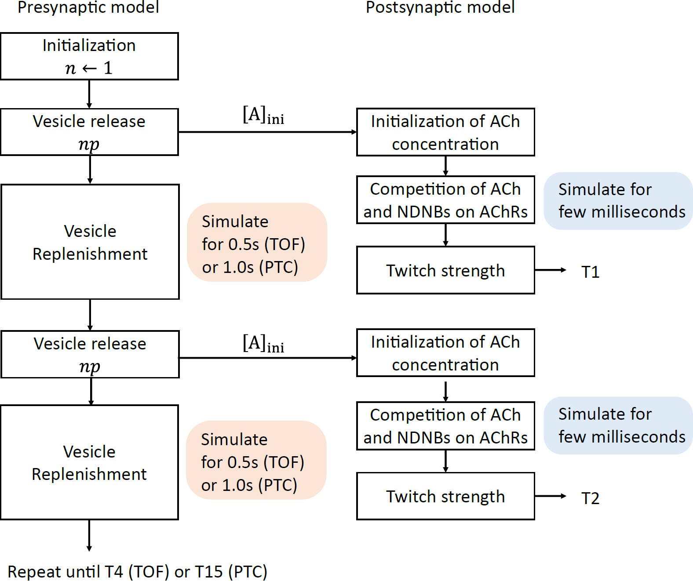

# Model Description

## Overview
This document describes the pharmacokinetic-pharmacodynamic (PK-PD) model used in this study to simulate neuromuscular blockade (NMB) induced by non-depolarizing neuromuscular blockers (NDNBs). The model integrates pre- and post-synaptic mechanisms of neuromuscular transmission and predicts neuromuscular monitoring measures such as Train-of-Four Ratio (TOFR), Train-of-Four Count (TOFC), and Post-tetanic Count (PTC). The model parameters were identified using clinical data obtained at Kagawa University Hospital with approval from the institutional medical ethics committee.

## Pharmacokinetic (PK) Model
The pharmacokinetic model describes the absorption, distribution, metabolism, and elimination of rocuronium using a three-compartment model:

\[
\frac{dx(t)}{dt} = Ax(t) + Bu(t)
\]

where:
- \( x(t) \) represents the drug concentrations in the central, shallow peripheral, and deep peripheral compartments.
- \( A \) is a matrix of rate constants governing drug transfer between compartments.
- \( B \) represents drug infusion input.

The Magorian model was selected for PK parameterization based on its superior fit to Japanese patient data.

## Pharmacodynamic (PD) Model
The PD model characterizes the effect of NDNBs at the neuromuscular junction by incorporating both pre- and post-synaptic mechanisms:

1. **Pre-synaptic Model**: Describes acetylcholine (ACh) release and depletion under NDNB influence.
2. **Post-synaptic Model**: Simulates the interaction of ACh and NDNB with acetylcholine receptors (AChRs), affecting muscle contraction strength.

  

## Model Implementation
The simulation framework consists of the following MATLAB scripts:
- **`main.m`**: Executes patient-specific simulations and visualizes results.
- **`pd_model.m`**: Implements the PD model, solving differential equations describing neuromuscular transmission.
- **`pk_magorian.m`**: Implements the PK model based on literature-reported parameters.
- **`pkpd_simulation.m`**: Runs a full PK-PD simulation, integrating the above models.

## Validation
The model was validated by comparing simulated TOFR, TOFC, and PTC with clinical observations. The estimated CE50 values fell within the range of published values for rocuronium, supporting the modelfs reliability. Future work includes extending the model to account for sugammadex reversal and real-time monitoring applications.

For dataset details, refer to [data_description.md](data_description.md).
